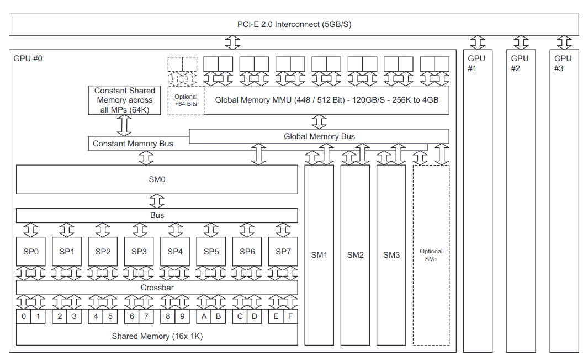

## Mini-curso de CUDA semana 2

*Esta semana revisaremos algunos conceptos relacionados con el computo en paralelo así como 
algunos puntos importantes respecto de la arquitectura de una PC y una GPU
con la finalidad de entender la codificación y posibilidades que nos ofrece CUDA.*

*De igual manera empezaremos a dar los primeros pasos en la codificación de CUDA con algunos ejemplos
sencillos.*
### Algunos conceptos sobre computo.
Estas definiciones las usaremos a los largo del curso por lo cual es importante entenderlas desde un inicio.
- Proceso:
    Es una instancia de un programa que esta siendo ejecutada.
- Context:
    Es una colección de data acerca del proceso que permite al procesador suspender o mantener
    la ejecución de un proceso.

- Thread:
    Es un componente de un proceso y es la secuencia mínima de una instrucción programada
    que es manejada de manera independiente por un scheduler.

- Kernel:
    Es un elemento que permite administrar el funcionamiento de un proceso.
- Grid:
    Es el conjunto de todos los Threads lanzados por un Kernel
- Block:
    Es el subconjunto de Threads dentro de un grid.
### Arquitectura de una PC  y una GPU.
**PC Arquitectura.**


**GPU Arquitectura.**


Memory = global, constant, shared

SP = Streaming processors

SM = Streaming multiprocessors
### Primeros pasos en CUDA.
----
**Example 1.  Hello World in CUDA.**


Primero construimos un archivo con las siguientes librerias de CUDA con extensión .cu,
así como la librería estadar de input output, dicha extensión indicará que este documento se ejecutará en la GPU.

```
#include "cuda_runtime.h"
#include "device_launch_parameters.h"

```


Después procedemos a crear un kernel con la acción que queremos realizar.
```
__global__ void hello_cuda()
{

}
```
Por último incluimos hello_cuda en la función main de nuestro código añadiendo
nuestro kernel de la siguiente manera.

```
kernel_name<<<number_of_blocks, 
                thread_per_block>>>
```

Adicional llamamos dos funciones de Cuda para sincronizar nuestro elemento con la memoria del host y reiniciar la GPU.

```
cudaDeviceSynchronize();
cudaDeviceReset();
```

Veamos algunas modificaciones adicionales que podemos realizar.

Podemos jugar modificando el kernel añadiendo más bloques o número de hilos pero hay que tener en cuenta que estos también pueden tener más dimensiones, como sería el caso de un vector (x,y,z). 
Por ejemplo: vamos a lanzar hello_cuda con en un grid de una dimension con 32 threads agrupados en 8 blocks con 4 threads en la dirección x.

    dim3 block(4);
    dim3 grid(8);
    hello_cuda<<<grid, block>>>();
o de la siguiente manera (donde notamos que al inicializar el arreglo dim3 por default tienen valor 1 todas las dimensiones por esto no se ponen, todo esto dentro del main)

    dim3 block(4,1,1);
    dim3 grid(8,1,1);
    hello_cuda<<<grid, block>>>();
Este ejemplo nos regresará la impresión de 32 "Hello world in cuda", ¿pero que pasa si cambiamos  el block por (8,1,1) y el grid por (4,1,1)?

Ahora añadamos una dimesión adicional a nuestro arreglo y veamos que pasa, tomando un total de 64 threads consideremos 4 bloques con dimensiones x = 8 y y=2 

    int nx , ny;
    nx=16;
    ny = 4;
    dim3 block(8,2);
    dim3 grid(nx/block.x,ny/block.y);
    hello_cuda<<<grid, block>>>();  

La pregunta obligada en este punto ¿Cuál es el límite para los hilos y bloques que puedo usar?

Limitación para el tamaño del bloque:
$$x <=1024$$
$$y <=1024$$
$$z <=644$$
$$x \times y \times z <= 1024$$

Limitaciones para el grid:
$$x <=2^{32}-1$$
$$y <=65536$$
$$z <=65536$$

---
**Example 2: Identificando thread -- threadIdx**

---

### Ejercicio de tarea.
-   Armar la secuencia de fibonacci en Cuda donde todo se ejecute en la GPU hasta cierto número.
-   Crea varios arreglos aleatorios y realiza su producto interno en diferentes hilos y bloques.
-   Medir el uso de la GPU misma en la ejecución.  


### Bibliografía.
-   https://docs.nvidia.com/cuda/cuda-c-programming-guide/index.html#global
-   Cuda programming, Morgan Kaufmann(2012).


### Nota:
Los códigos de los ejemplos del curso serán cargados al final de la semana una vez que los alumnos hayan completado los ejercicio de tarea y en clase.
